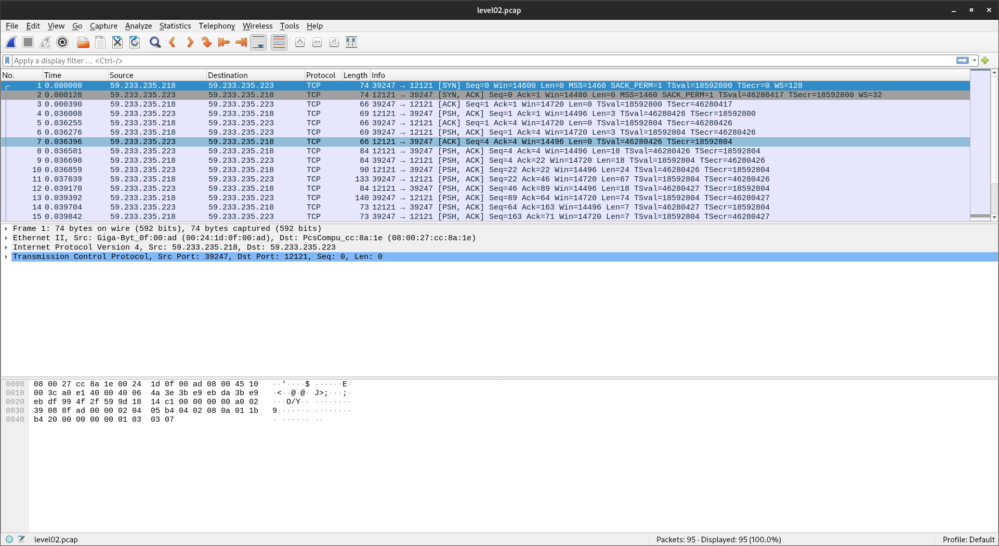

# **snow-crash**
### an introduction to the wonderful world of ✨cybersecurity✨

### level00 :
ok so, first of, what do we have to work with ?

```sh
level00@SnowCrash:~$ ls -la
total 12
dr-xr-x---+ 1 level00 level00  100 Mar  5  2016 .
d--x--x--x  1 root    users    340 Aug 30  2015 ..
-r-xr-x---+ 1 level00 level00  220 Apr  3  2012 .bash_logout
-r-xr-x---+ 1 level00 level00 3518 Aug 30  2015 .bashrc
-r-xr-x---+ 1 level00 level00  675 Apr  3  2012 .profile
```
so, we don't have much to work with, at least here !
Let's try to aim directly for the flag.
When running the following command : `ls -lR / 2>/dev/null | grep flag00`
we get :
```sh
----r--r-- 1 flag00  flag00      15 Mar  5  2016 john
----r--r--  1 flag00  flag00      15 Mar  5  2016 john
```
Alright, well, that was easy enough ! now let's see if we can read it.
```sh
$> whereis john
john: /usr/sbin/john
```
```sh
cat /usr/sbin/john
cdiiddwpgswtgt
```
here it is ! we have just found the flag !
We aren't done yet though, if we try this password we get an incorrect password, subsequently, let's decrypt it.
Using Dcode's cipher recognition tool with the keyword **john**, we are prompted with:
`nottoohardhere`
using the affine-cipher method.
Now that you have inputed the password and recuperated the following token with the **getflag** function let's keep going :
`x24ti5gi3x0ol2eh4esiuxias`

# level01 :
Let's repeat what we have done just before.
using **ls** we can't find anything.
Let's check */etc/passwd* just in case our user was a bit lazy...
```sh
level01@SnowCrash:~$ cat /etc/passwd
[...]
flag01:42hDRfypTqqnw:3001:3001::/home/flag/flag01:/bin/bash
[...]
```
Here we go. now as you can guess this one seems encrypted as well, Dcode here we come.
Aaaaaaaaaaaaaaaaaaaaaaaaaaaaand **NOTHING**...
ok well let's look up how the keyword john might just help.
After a quick google search we find `John The Ripper` a password cracking software. niiiiiiice.
Now having taken 95 minutes to install and comprehend `John` we get :
`abcdefg`
and well, fuck you for that.
`f2av5il02puano7naaf6adaaf`

# level02 :
```sh
level02@SnowCrash:~$ ls -la
total 24
dr-x------ 1 level02 level02  120 Mar  5  2016 .
d--x--x--x 1 root    users    340 Aug 30  2015 ..
-r-x------ 1 level02 level02  220 Apr  3  2012 .bash_logout
-r-x------ 1 level02 level02 3518 Aug 30  2015 .bashrc
----r--r-- 1 flag02  level02 8302 Aug 30  2015 level02.pcap
-r-x------ 1 level02 level02  675 Apr  3  2012 .profile
```
here we go A FILE !
so what of it, what's a pcap ? Well, a pcap is an interface for capturing network traffic, basically a file that logs data sent through a network.
The most logical way to read it (to me) is through **wireshark** so let's do it.
First of, we need the file, file which is located in our VM that does not have wireshark installed and where we have no rights to install it.
let's use **SCP**
SCP allows me to copy a file securely through an ssh connection so you are going to need your level02 token.
Ok now we have the file let's see that.

This kind of looks like incomprehensible gibberish but we don't need to understand everything that is going on.
What matters is the data, you just have to click on any packet and look if it has a subsection **Data** under **Transmission Control Protocol**.
if it does, you will be able to read what was sent to you.
After a bit of scrolling we can see that we have received a **login** and a **password** but we only want the password so let's focus on that.
after reading every bytes of data sent after the **password** prompt we get :
`f t _ w a n d r · · · N D R e l · L 0 L · ···`
There are still a few bytes of data afterwards but after a while I understood that receiving `···` meant the end of line.
So let's input the password yeah ?
Again, that doesn't work. So what's the gist ?
Well it turns out the **·** character means **backspace**, giving us the following password :
`ft_waNDReL0L`
(don't ask me why but it seems the last *backspace* does not work as one).
And right after inputing the password and launching getflag I get my token !
`kooda2puivaav1idi4f57q8iq`

# level03 :
```sh
level03@SnowCrash:~$ ls -la
total 24
dr-x------ 1 level03 level03  120 Mar  5  2016 .
d--x--x--x 1 root    users    340 Aug 30  2015 ..
-r-x------ 1 level03 level03  220 Apr  3  2012 .bash_logout
-r-x------ 1 level03 level03 3518 Aug 30  2015 .bashrc
-rwsr-sr-x 1 flag03  level03 8627 Mar  5  2016 level03
-r-x------ 1 level03 level03  675 Apr  3  2012 .profile
```
A file again, and an executable.
This is where it gets tricky.
First let's execute it.
```sh
level03@SnowCrash:~$ ./level03 | cat -e
Exploit me$
```
Hmmm this isn't exactly helpful, and that means we're going to dive in the wonderous world of ***disassembly***...
What disassembling does is translating machine language into assembly language. A very useful **reverse-engineering** tool.
I'll save you the trouble of looking for hours on end how to disassemble an executable properly. So here is what I ended up doing.
First I disassemble level03 with ltrace and I get this :
```sh
level03@SnowCrash:~$ ltrace ./level03 
__libc_start_main(0x80484a4, 1, 0xbffff7f4, 0x8048510, 0x8048580 <unfinished ...>
getegid()                                        = 2003
geteuid()                                        = 2003
setresgid(2003, 2003, 2003, 0xb7e5ee55, 0xb7fed280) = 0
setresuid(2003, 2003, 2003, 0xb7e5ee55, 0xb7fed280) = 0
system("/usr/bin/env echo Exploit me"Exploit me
 <unfinished ...>
--- SIGCHLD (Child exited) ---
<... system resumed> )                           = 0
+++ exited (status 0) +++
```
Do you see it ? Our ticket to level04. Laying inches from our fingers...
`system("/usr/bin/env echo Exploit me"Exploit me`
What we see here is the fact that they are using the built-in function `echo`.
You might be wondering just why that's interesting ? Well see, what tells your computer where echo is defined is the `PATH` variable. A variable you can define **YOURSELF**.
The only thing you'll need to do is add /tmp to your **ENV** with the following line :
```sh
export PATH=/tmp:$PATH
```
Now that you have you very own folder in the PATH you'll need to make echo execute getflag.
There are quite a few ways to go at it such as making echo a symlink of getflag or copying getflag into echo, however I find the simplest answer is often the best so i'll just open my file with nano (or vim) and write **getfile** in the echo file.
Then simply give the appropriate rights to your echo file and you should be good to go.
```sh
chmod 777 /tmp/echo
```
You can now execute **./level03** and get your token :
`qi0maab88jeaj46qoumi7maus`

# level04 :
